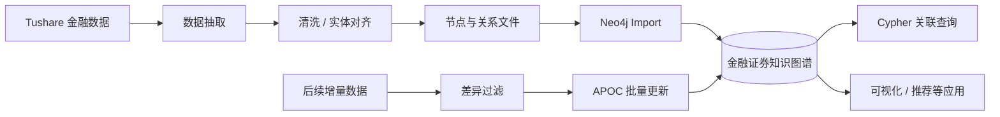
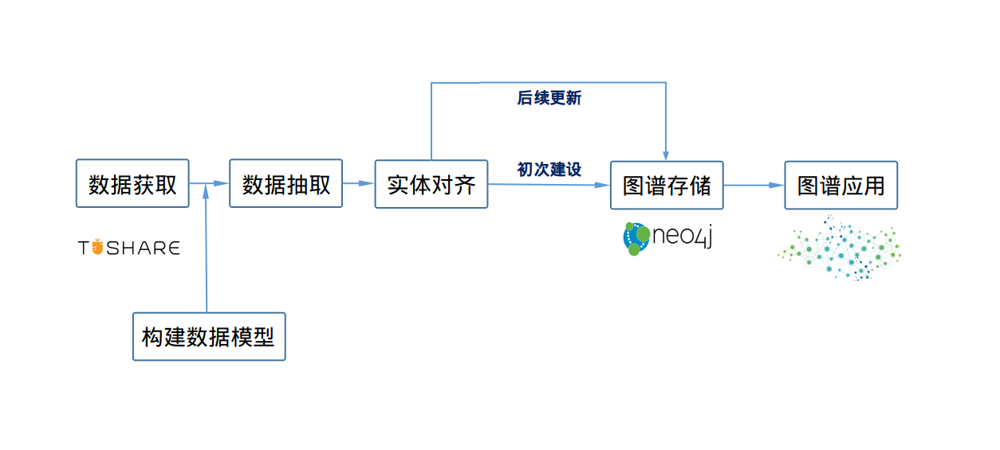
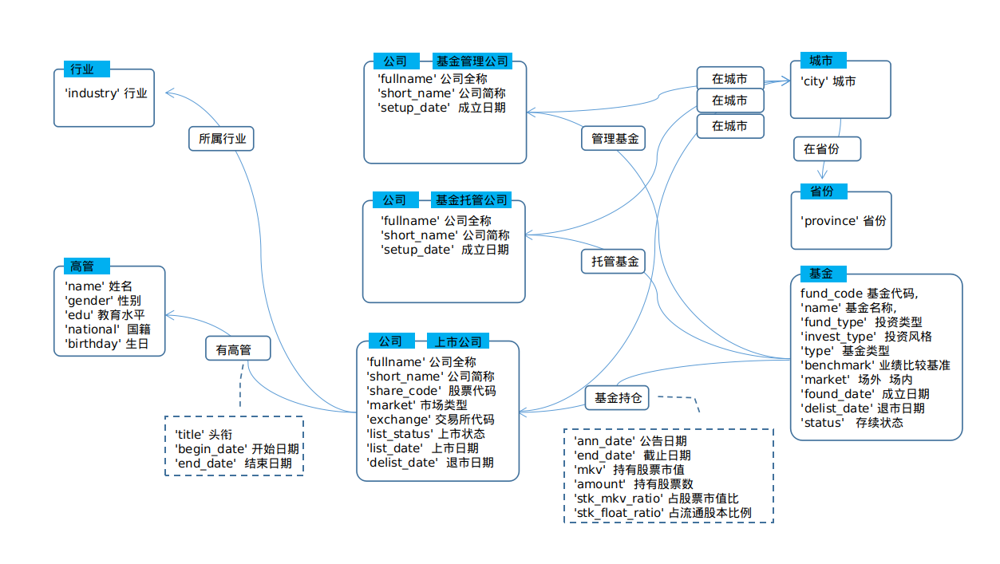
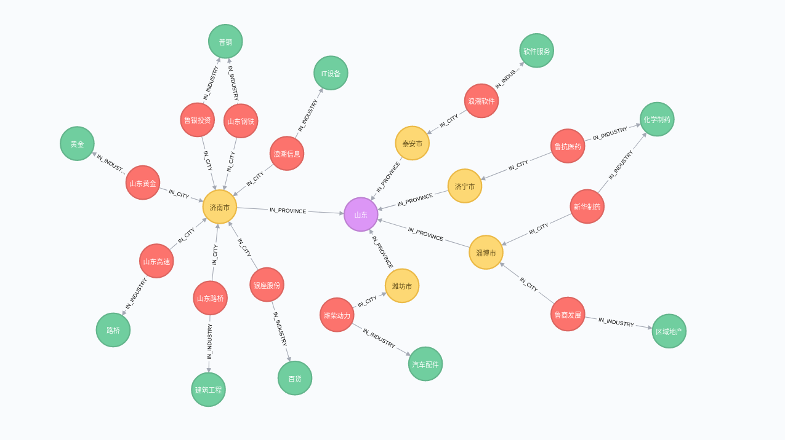
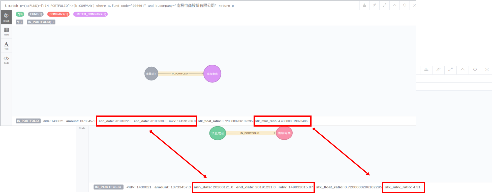

<div align="center">

# 金融证券知识图谱

### 从金融数据抽取，到 Neo4j 图谱构建、查询应用与增量更新的完整实践

[English](README_EN.md) · [视频教程](#视频教程) · [数据模型](#数据模型) · [图谱应用](#图谱应用)

<p>
  
  
  
  
</p>

</div>

> **项目说明**
>
> 这是我在 2020–2021 年完成的一套金融知识图谱实践项目。它保留了当时使用的 Neo4j / Tushare / py2neo 版本，主要价值在于展示一个知识图谱从 **数据获取 → 建模 → 抽取 → 实体处理 → 图数据库导入 → 图查询 → 增量更新** 的完整闭环。
>
> 由于依赖版本和外部数据接口都可能已经变化，今天使用时请把它视为**可复现的学习案例与架构参考**，而不是最新版本的生产模板。

---

## 为什么这个项目值得保留

很多 Knowledge Graph 示例只展示“把数据导入 Neo4j”，但真实图谱系统还需要面对：

- 数据从哪里来、如何筛选；
- 节点和关系怎样设计；
- 同一实体的不同名称如何对齐；
- 图数据库如何高效导入和建立索引；
- 图谱建好以后能做什么查询；
- **数据变化以后，图谱如何持续更新。**

这个项目刻意把这些环节串成一个完整流程，并用中国证券市场公开数据做演示。

## 整体流程





## 项目内容

| 阶段 | Notebook | 目标 |
| --- | --- | --- |
| 1 | `1.get-data.ipynb` | 获取并筛选金融数据 |
| 2 | `2.graph-data-process.ipynb` | 按图模型处理节点和关系 |
| 3 | `3.graph-data-to-database.ipynb` | 导入 Neo4j、创建索引 |
| 4 | `4.application.ipynb.ipynb` | 图查询与应用示例 |
| 5 | `5.update-graph-get-data.ipynb` | 获取增量数据 |
| 6 | `6.update-graph-filter-data.ipynb` | 识别变化和更新对象 |
| 7 | `7.update-graph-modify-database.ipynb` | APOC 批量更新与核验 |

## 视频教程

项目配套 7 集视频，按完整流程拆解：

1. [图谱建设：数据准备和图模型构建](https://www.bilibili.com/video/BV1wf4y1c7E2)
2. [图谱建设：数据抽取](https://www.bilibili.com/video/BV1tf4y1c7o2)
3. [图谱建设：数据导入](https://www.bilibili.com/video/BV1Kf4y177K6)
4. [图谱应用](https://www.bilibili.com/video/BV14v411g7wC)
5. [图谱更新：数据抽取](https://www.bilibili.com/video/BV1pf4y1c7zN?p=2)
6. [图谱更新：数据过滤](https://www.bilibili.com/video/BV1PL4y167XL)
7. [图谱更新：更新与核验](https://www.bilibili.com/video/BV1WQ4y1B7DQ)

## 数据来源

项目基于 [Tushare](https://tushare.pro/document/2) 的金融数据接口，选取了六类数据：

- 股票列表
- 上市公司基本信息
- 上市公司管理层
- 公募基金列表
- 公募基金公司
- 公募基金持仓数据

> Tushare 当前接口、权限和字段可能已经与项目开发时期不同。复现时请以 Tushare 最新文档为准。

## 数据模型

### 实体 / 节点

项目包含：

1. 省份 `PROVINCE`
2. 城市 `CITY`
3. 公司 `COMPANY`
4. 上市公司管理层 `MANAGER`
5. 基金 `FUND`
6. 行业 `INDUSTRY`

公司节点进一步覆盖上市公司、基金管理公司和基金托管公司等类型。

### 主要关系

```text
CITY ──IN_PROVINCE──> PROVINCE

COMPANY ──IN_CITY──> CITY
LISTED_COMPANY ──HAS_MANAGER──> MANAGER
LISTED_COMPANY ──IN_INDUSTRY──> INDUSTRY

FUND ──HAS_MANAGEMENT──> FUND_MANAGER
FUND ──HAS_CUSTODIAN──> FUND_CUSTODIAN
FUND ──IN_PORTFOLIO──> LISTED_COMPANY
```



## 图谱规模

当时构建的数据规模如下：

| 类型 | 标签 | 数量 |
| --- | --- | ---: |
| 省份 | PROVINCE | 32 |
| 城市 | CITY | 341 |
| 基金 | FUND | 11,045 |
| 高管 | MANAGER | 163,613 |
| 行业 | INDUSTRY | 110 |
| 公司 | COMPANY | 19,000 |
| 上市公司 | LISTED_COMPANY | 3,773 |
| 基金管理公司 | FUND_MANAGER | 15,292 |
| 基金托管公司 | FUND_CUSTODIAN | 40 |
| **合计** | — | **213,246** |

这些数字对应项目当时的数据快照，不代表当前市场实时规模。

## 图谱应用

项目没有把“建图”当终点，而是进一步展示图数据如何服务上层分析。

### 1. 关联可视化

例如查看一组山东国资背景上市公司在城市和行业上的关联分布：

```cypher
MATCH p1 = (a:LISTED_COMPANY)-[:IN_INDUSTRY]-(b:INDUSTRY)
WHERE a.share_code IN [
  "600022","600547","600223","600858",
  "600350","000498","000338","000977",
  "600756","600784","000756","600789"
]
MATCH p2 = (a)-[:IN_CITY]-(c:CITY)-[:IN_PROVINCE]-(d:PROVINCE)
RETURN p1, p2
```



### 2. 关联查询

Notebook 中还包含几个典型问题：

- 江苏省被基金持仓最多的上市公司；
- 上市公司高管 / 董事之间的兼任关系；
- 基于持仓行业分布计算基金相似度，并推荐 Top 5 相似基金。

这些例子对应知识图谱在**关系排查、推荐、风险关联分析**等场景中的基础能力。

## 增量更新

这是这个项目区别于很多一次性 Neo4j Demo 的地方。

更新阶段使用 APOC 的 `apoc.periodic.iterate`，覆盖了常见变化：

- 节点新增 / 删除标签；
- 节点属性新增 / 修改；
- 新增关系；
- 关系属性新增 / 修改。

更新后再通过具体样本进行核验。



## 当时的技术环境

项目最初使用：

| 组件 | 版本 |
| --- | --- |
| Neo4j | 3.4.7 |
| Tushare | 1.2.48 |
| py2neo | 4.3.0 |
| APOC | 3.4.0.3 |

这些版本现在已经较老，保留它们是为了保证项目历史可追溯性。新项目请优先使用对应组件的当前稳定版本。

## 目录结构

```text
.
├── data/
├── data_update/
├── pictures/
├── requirements.txt
├── docker-compose.yml
└── scr/
    ├── 1.get-data.ipynb
    ├── 2.graph-data-process.ipynb
    ├── 3.graph-data-to-database.ipynb
    ├── 4.application.ipynb.ipynb
    ├── 5.update-graph-get-data.ipynb
    ├── 6.update-graph-filter-data.ipynb
    └── 7.update-graph-modify-database.ipynb
```

## 现在回头看

这个项目对我更重要的价值，不是某个 Neo4j API，而是让我形成了一种后来反复使用的系统思维：

> **知识不是“存进去”就结束了，而要经历结构化、连接、查询、更新和复用。**

这条思路后来也延伸到我对 Knowledge Infrastructure、Agent Memory 和长期知识资产的探索中。

---

<div align="center">

**From scattered data to connected knowledge.**

[GitHub Profile](https://github.com/kevin-meng)

</div>
