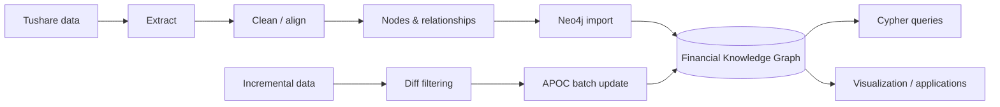

# Financial Securities Knowledge Graph

> A historical, reproducible project demonstrating the full lifecycle of a financial knowledge graph: **data acquisition → graph modeling → extraction → entity processing → Neo4j import → graph queries → incremental updates**.

[中文文档](README.md)

<p>
  
  
  
</p>

## Project status

This project was built in **2020–2021** using the Neo4j, Tushare and py2neo versions available at that time. It is intentionally kept as a historical learning project and architecture reference.

External APIs and dependency versions may have changed. For new production systems, use current stable versions and current provider documentation.

## What the project covers

Unlike one-off “load a CSV into Neo4j” demos, this project covers the operational lifecycle of a graph:

- selecting related financial datasets;
- designing entities and relationships;
- extracting and aligning data;
- importing to Neo4j and creating indexes;
- querying relationships with Cypher;
- building analysis / recommendation examples;
- detecting changes and incrementally updating the graph.




## Data model

Core node types include:

- Province
- City
- Company
- Listed company
- Manager
- Fund
- Industry
- Fund manager
- Fund custodian

Core relationships include location, industry, management, custody, executive and portfolio-holding relationships.

The original snapshot contained **213,246 graph entities** across these categories.

## Example applications

The notebooks demonstrate:

- geographic / industry relationship visualization;
- fund-holding analysis;
- cross-company executive relationships;
- fund similarity and recommendation based on industry allocation.


## Incremental update

The project also demonstrates graph maintenance with APOC, including:

- node label changes;
- node property changes;
- new relationships;
- relationship property updates;
- post-update verification.


## Original environment

| Component | Version |
| --- | --- |
| Neo4j | 3.4.7 |
| Tushare | 1.2.48 |
| py2neo | 4.3.0 |
| APOC | 3.4.0.3 |

## Tutorials

A seven-part Chinese video tutorial accompanies the repository. See the [Chinese README](README.md#视频教程) for the complete list.

## Retrospective

The most durable lesson from this project is not a specific Neo4j API. It is the idea that useful knowledge systems require a lifecycle:

```text
data → structure → connection → query → update → reuse
```

That idea continues to influence my later work on knowledge infrastructure and long-term memory for AI agents.

---

**From scattered data to connected knowledge.**
